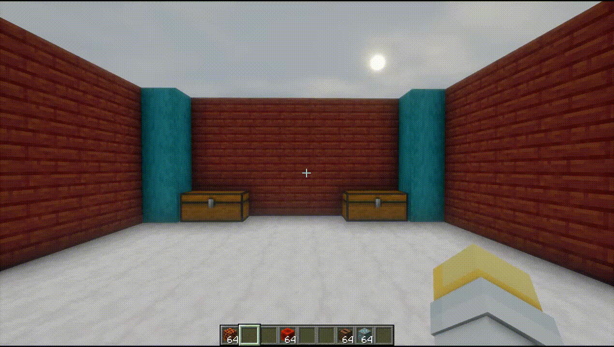
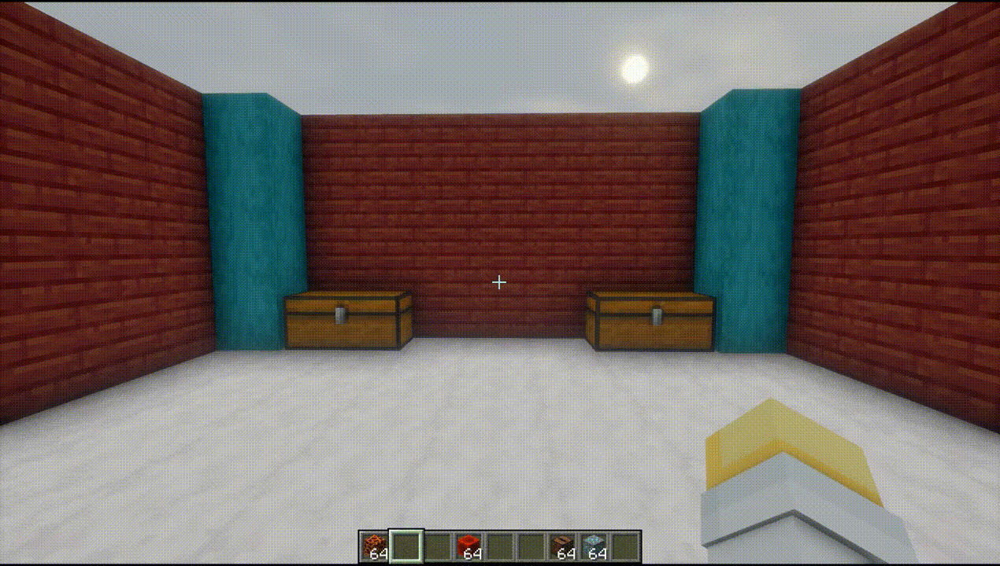
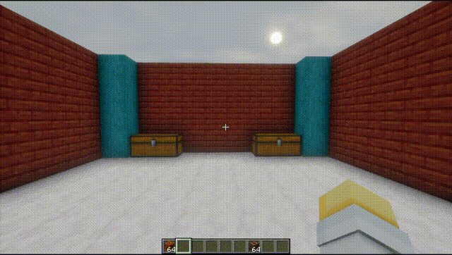
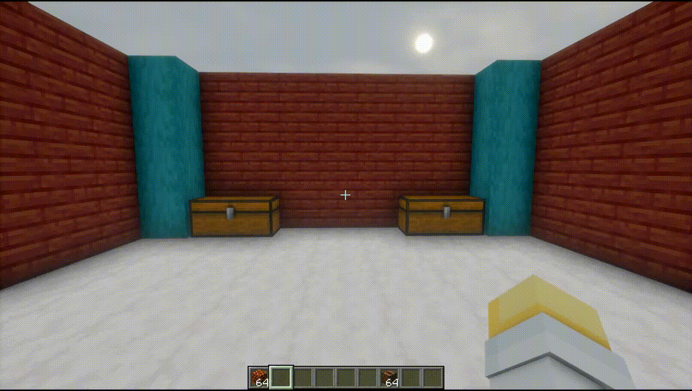

# Chest Profile

мод на майнкрафт, который раскладывает вещи по сундукам по готовым раскладкам. настрой профиль с предметами, и он сам перенесет нужное количество из инвентаря. призрачные иконки показывают, что куда должно лечь.
#### +мой конфиг для мода со всеми блоками из выживания
## что умеет

- конфиги с профилями. до 50 конфигов, до 128 профилей в каждом
- в профиле лежит набор предметов с количеством. по сути, это раскладка сундука
- призрачные предметы. даже в пустом сундуке видно, где и что должно лежать
- автозаполнение. переносит из инвентаря ровно столько, сколько нужно по раскладке
- привязка к сундуку. у каждого сундука запоминается свой активный профиль и конфиг
- панель рядом с сундуком. листай конфиги, выбирай профиль, наведи и посмотри состав
- настройки. создание, удаление, переименование конфигов и профилей, скрытие панели
- импорт и экспорт через буфер обмена или файл json, свой файловый диалог
- конструктор раскладок открывается прямо из меню
- хоткеи на перенос и на скрытие панели
- интерфейс на русском и английском
- fabric и neoforge

## демо

| | |
| :---: | :---: |
|  |  |
| **панель и призраки.** открой сундук и слева появится панель с конфигами и профилями. листай конфиги стрелками или скроллом, выбирай профиль. | **автозаполнение.** выбери профиль и нажми кнопку заполнения — предметы из инвентаря переносятся по раскладке. |
|  |  |
| **привязка к сундукам.** у каждого сундука своя память. в разных сундуках разные профили, по дефолту никакого. | **настройки.** шестеренка на панели открывает меню. создание, удаление, переименование конфигов и профилей, скрытие панели, импорт и экспорт через буфер обмена или файл. |

## как пользоваться

1. открой сундук. слева появится панель с конфигами и профилями
2. в настройках (шестеренка на панели) нажми конструктор раскладки — откроется удобный сайт
3. собери раскладку, добавляя предметы
4. выбери профиль и нажми кнопку заполнения
5. мод сам перенесет предметы из инвентаря по профилю

> профиль привязывается к конкретному сундуку по координатам. так что у каждого сундука может быть свой профиль

## сборка

нужен jdk 25.

1. `./gradlew build` соберет и fabric, и neoforge
2. готовые jar-ки появятся в `build/libs/`
3. кидай в папку модов

конфиг лежит в `config/chestprofile.json`, файлы конфигов в `config/chestprofile/configs/`.

## как это устроено

- общий код в `common`, тонкие обертки под fabric и neoforge
- раскладка считается по количеству предметов в инвентаре и сундуке. сколько стаков, столько слотов и занимает
- перенос через миксин `AbstractContainerScreen`. движок кликает по слотам как игрок, по несколько шагов за тик
- панель и призраки рисуются через `GuiGraphicsExtractor`
- профиль привязывается к сундуку по `dimension:x,y,z`

## благодарность

[TerminalMC](https://github.com/TerminalMC/ClientSort) - взял у него некоторые наработки переноса предметов + совместим с ним

[Cubicmetre](https://mis-builder.cubicmetre.net/) - конфиг делается через его сайт

---

# Chest Profile

a minecraft mod that organizes items in chests using preset layouts. set up a profile with items, and it will automatically transfer the required amounts from your inventory. ghost icons show where each item belongs.
#### +my config for mod with all survival items
## what it does

- configs with profiles. up to 50 configs, up to 128 profiles each
- each profile holds a set of items with counts. essentially a chest layout
- phantom items. even in an empty chest, you can see where and what should go
- auto-fill. transfers exactly as much from your inventory as the layout requires
- per-chest binding. each chest remembers its own active profile and config
- panel next to the chest. browse configs, select profiles, hover to see contents
- settings. create, delete, and rename configs and profiles, hide the panel
- import and export via clipboard or json file, with a built-in file dialog
- layout builder opens directly from the menu
- hotkeys for transferring items and toggling the panel
- interface in russian and english
- fabric and neoforge

## demo

| | |
| :---: | :---: |
|  |  |
| **panel and ghost items.** open a chest and a panel appears on the left with configs and profiles. browse configs using the arrows or scroll wheel, and select a profile. | **auto-fill.** select a profile and click the fill button — items from your inventory are transferred according to the layout. |
|  |  |
| **per-chest binding.** each chest has its own memory. different chests can have different profiles, none selected by default. | **settings.** the gear icon on the panel opens the menu: create, delete, and rename configs and profiles, toggle panel visibility, and import/export via clipboard or file. |

## how to use

1. open a chest. the panel with configs and profiles appears on the left
2. in settings (the gear icon on the panel), click layout builder — a convenient website will open
3. build the layout by adding items
4. select a profile and click the fill button
5. the mod will automatically transfer items from your inventory according to the profile

> a profile is bound to a specific chest by its coordinates, so each chest can have its own profile

## building

requires jdk 25.

1. `./gradlew build` will build both fabric and neoforge
2. compiled jar files will appear in `build/libs/`
3. drop them into your mods folder

config is located at `config/chestprofile.json`, config files in `config/chestprofile/configs/`.

## how it works

- shared code in `common`, thin wrappers for fabric and neoforge
- layout is calculated based on item counts in the inventory and chest. more stacks occupy more slots
- item transfer via an `AbstractContainerScreen` mixin. the engine clicks slots like a player, multiple steps per tick
- the panel and ghost items are rendered via `GuiGraphicsExtractor`
- profiles are bound to chests by `dimension:x,y,z`

## credits

[TerminalMC](https://github.com/TerminalMC/ClientSort) - inspired some item transfer concepts + ui compatibility

[Cubicmetre](https://mis-builder.cubicmetre.net/) - for config site creation

